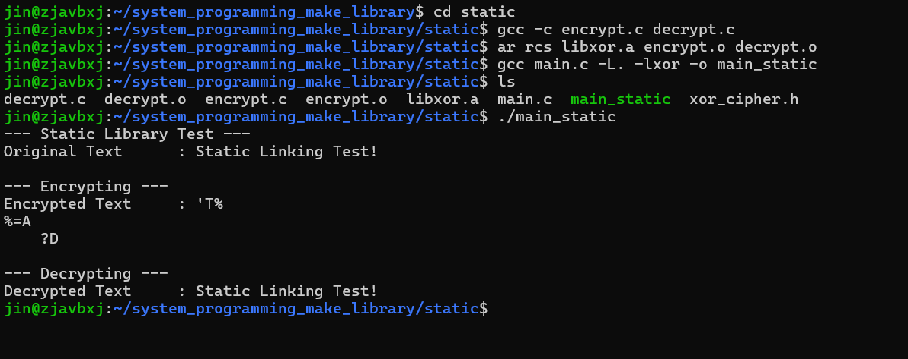
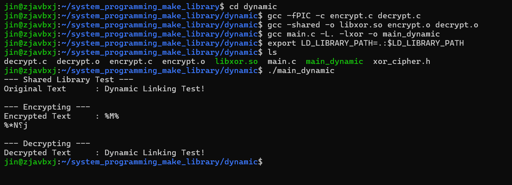

# XOR Cipher Library: Static, Dynamic, and Runtime Linking

본 문서는 간단한 XOR 암호화/복호화 함수를 C 라이브러리로 만들고, 이를 사용하는 세 가지 주요 링킹 방식(정적, 동적, 런타임)을 설명합니다.

## 개발 환경

*   **OS**: Ubuntu 24.04 LTS (or compatible Linux)
*   **Compiler**: GCC 13.3.0 (or compatible)

## 리포지토리 구조

```
.
├── static/
│   ├── main.c
│   ├── encrypt.c
│   ├── decrypt.c
│   ├── xor_cipher.h
│   ├── libxor.a
│   └── main_static
├── dynamic/
│   ├── main.c
│   ├── encrypt.c
│   ├── decrypt.c
│   ├── xor_cipher.h
│   ├── libxor.so
│   └── main_dynamic
├── runtime/
│   ├── main_runtime.c
│   ├── encrypt.c
│   ├── decrypt.c
│   ├── xor_cipher.h
│   ├── libxor.so
│   └── main_runtime
└── README.md
```

## 코드 설명

### `xor_cipher.h`

암호화 및 복호화 함수의 프로토타입을 선언하는 헤더 파일입니다.

```c
#ifndef XOR_CIPHER_H
#define XOR_CIPHER_H


void xor_encrypt(char* data, const char* key);
void xor_decrypt(char* data, const char* key);

#endif // XOR_CIPHER_H
```

### `encrypt.c` / `decrypt.c`

주어진 데이터를 키(key)를 사용하여 XOR 연산을 통해 암호화/복호화하는 함수의 구현부입니다. XOR 연산의 특성상 두 함수의 로직은 동일합니다.

```c
#include <string.h>
#include "xor_cipher.h"

void xor_encrypt(char* data, const char* key) {
    if (data == NULL || key == NULL) return;
    size_t key_len = strlen(key);
    if (key_len == 0) return;
    
    size_t data_len = strlen(data);
    for (size_t i = 0; i < data_len; ++i) {
        data[i] ^= key[i % key_len];
    }
}
```

### `main.c` (Static/Dynamic Linking)

라이브러리를 사용하는 메인 프로그램입니다.
dynamic 코드는 static과 메시지, 키 제외하고 동일합니다.
```c
#include <stdio.h>
#include <string.h>
#include <stdlib.h>
#include "xor_cipher.h"

int main() {
    char message[] = "Static Linking Test!";
    const char* secret_key = "KeyStatic";

    printf("--- Static Library Test ---\n");
    printf("Original Text      : %s\n", message);
    printf("\n");

    printf("--- Encrypting ---\n");
    xor_encrypt(message, secret_key);
    printf("Encrypted Text     : %s\n", message);
    printf("\n");

    printf("--- Decrypting ---\n");
    xor_decrypt(message, secret_key);
    printf("Decrypted Text     : %s\n", message);

    return 0;
}
```

### `main_runtime.c` (Runtime Linking)

Runtime Linking에서 사용되는 main 코드입니다.
`dlopen`과 `dlsym`을 사용해 런타임에 동적으로 라이브러리를 로드하고 함수를 호출합니다.

```c
#include <stdio.h>
#include <string.h>
#include <stdlib.h>
#include <dlfcn.h>

int main() {
    void *handle;
    void (*encrypt_func)(char*, const char*);
    void (*decrypt_func)(char*, const char*);
    char *error;

    char message[] = "Runtime Loading Test!";
    const char* secret_key = "KeyRuntime";

    printf("--- Runtime Loading Test ---\n");
    printf("Original Text      : %s\n", message);
    printf("\n");

    handle = dlopen("./libxor.so", RTLD_LAZY);
    if (!handle) {
        fprintf(stderr, "%s\n", dlerror());
        exit(1);
    }

    encrypt_func = dlsym(handle, "xor_encrypt");
    if ((error = dlerror()) != NULL) {
        fprintf(stderr, "%s\n", error);
        exit(1);
    }

    decrypt_func = dlsym(handle, "xor_decrypt");
    if ((error = dlerror()) != NULL) {
        fprintf(stderr, "%s\n", error);
        exit(1);
    }

    printf("--- Encrypting ---\n");
    encrypt_func(message, secret_key);
    printf("Encrypted Text     : %s\n", message);
    printf("\n");

    printf("--- Decrypting ---\n");
    decrypt_func(message, secret_key);
    printf("Decrypted Text     : %s\n", message);

    if (dlclose(handle) < 0) {
        fprintf(stderr, "%s\n", dlerror());
        exit(1);
    }

    return 0;
}
```

---

## 빌드 및 실행

각각의 링킹 방식에 따라 해당 디렉토리로 이동하여 아래의 명령어를 순서대로 실행합니다.

### 1. Static Linking

`static` 폴더에서 실행합니다. 라이브러리 코드가 실행 파일에 완전히 포함됩니다.

```bash
# 1. 디렉토리 이동
cd static

# 2. 오브젝트 파일(*.o) 생성
gcc -c encrypt.c decrypt.c

# 3. 정적 라이브러리(*.a) 생성
ar rcs libxor.a encrypt.o decrypt.o

# 4. 메인 프로그램 컴파일 및 링크
gcc main.c -L. -lxor -o main_static

# 5. 프로그램 실행
./main_static
```



### 2. Dynamic Linking

`dynamic` 폴더에서 실행합니다. 실행 시점에 라이브러리를 링크하여 여러 프로그램이 공유할 수 있습니다.

```bash
# 1. dynamic 디렉토리로 이동
cd dynamic

# 2. 위치 독립 코드(-fPIC) 옵션으로 오브젝트 파일 컴파일
gcc -fPIC -c encrypt.c decrypt.c

# 3. 오브젝트 파일들을 묶어 공유 라이브러리(libxor.so) 생성
gcc -shared -o libxor.so encrypt.o decrypt.o

# 4. 메인 프로그램과 라이브러리를 링크하여 실행 파일(main_dynamic) 생성
gcc main.c -L. -lxor -o main_dynamic

# 5. 라이브러리 경로 설정 및 실행
export LD_LIBRARY_PATH=.:$LD_LIBRARY_PATH
./main_dynamic
```




### 3. Runtime Linking (Dynamic Loading)

프로그램이 실행 중에 `dlopen()` 함수를 사용하여 라이브러리를 직접 로드하는 방식입니다.

```bash
# 1. runtime 디렉토리로 이동
cd runtime

# 2. 공유 라이브러리(libxor.so) 생성 (dynamic과 동일)
gcc -fPIC -c encrypt.c decrypt.c
gcc -shared -o libxor.so encrypt.o decrypt.o

# 3. 메인 프로그램을 컴파일 (-ldl 옵션 필요)
gcc main_runtime.c -ldl -o main_runtime

# 4. 실행 (LD_LIBRARY_PATH 환경 변수 설정 필요)
export LD_LIBRARY_PATH=.:$LD_LIBRARY_PATH
./main_runtime
```


